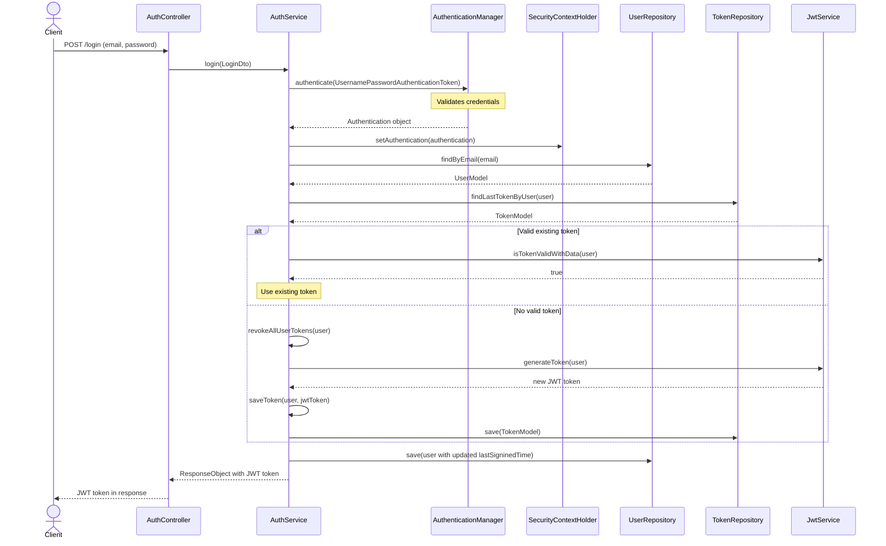
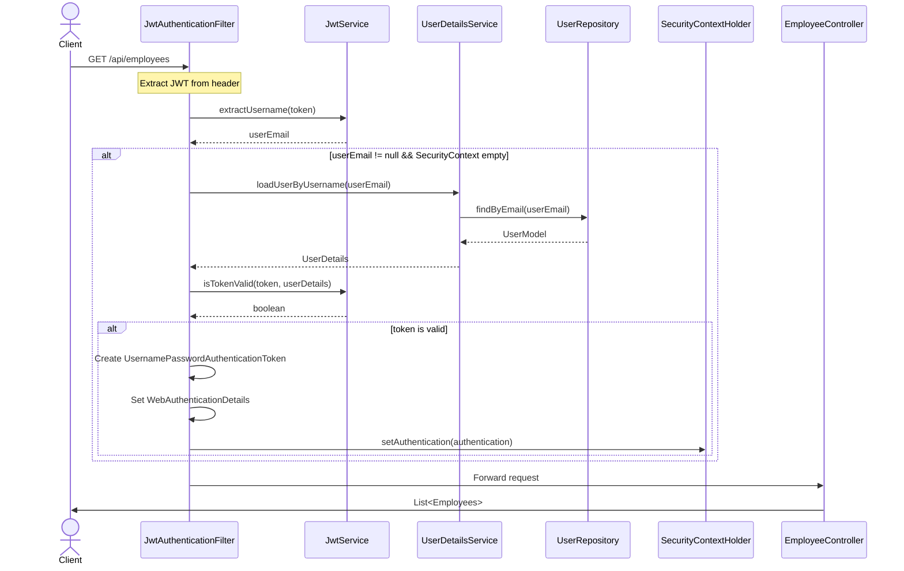

# Quy trình đăng nhập

# Quy trình xác thực

Tóm tắt sự hoạt động:
- Khi một yêu cầu bất kì được gửi tới máy chủ, các `JwtTokenFilter` sẽ chặn trước khi nó được quyền truy cập vào endpoint employees.
- Lấy thông báo từ header Authorization của yêu cầu sử dụng `JwtTokenProvider.resolveToken()`.
- Nếu mã thông báo được tìm thấy, nó sẽ được xác thực bằng cách sử dụng `validateToken()`.
- Nếu mã thông báo hợp lệ, *Filter Chain* sẽ tải chi tiết người dùng được liên kết với mã thông báo bằng cách sử dụng `loadUserByUsername` tại phương thức `UserDetailsService`.
- Tạo một đối tượng xác thực kiểu `UsernamePasswordAuthenticationToken` và đặt nó trong `SecurityContextHolder`.
- Từ đó, Filter Chain được gọi để chuyển yêu cầu và phản hồi đến bộ lọc tiếp theo hoặc tới endpoint.

# Ý nghĩa các hàm và sự cần thiết:

## 1. Security Configuration:
`SecurityConfig` định nghĩa các *@Bean* quan trọng như `AuthenticationManager`, `AuthenticationProvider`, `UserDetailsService` và `SecurityFilterChain` rất cần thiết để thực hiện xác thực và ủy quyền.

## 2. 

